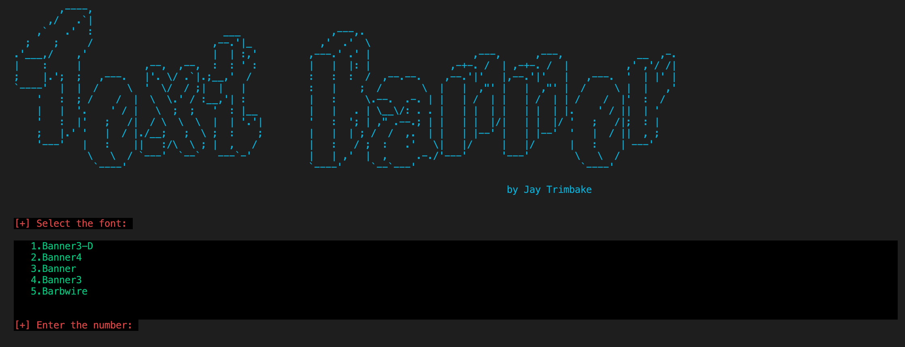

<!-- JayBanner -->

<p align="center">
  
</p>

<p align="center">Jaybanner</p>


### Installation

- Just, Clone this repository -
```
$ git clone https://github.com/JayTrimbake/jaybanner.git
```

- Change to cloned directory and run `python3 jaybanner.py` -
```
$ cd jaybanner
$ python3 requirement.py
$ python3 jaybanner.py
```

### Dependencies

**`jaybanner`** requires following programs to run properly - 
- `python3`

> All the dependencies will be installed automatically when you run `requirement.py` for the first time.

> Supported Platform :**`Ubuntu/Debian/Kali/Parrot`**, **`Arch Linux/Manjaro`**, **`Fedora`**

### Find Me on :
<p align="left">
  <a href="https://github.com/JayTrimbake" target="_blank"></a>
  <a href="https://www.instagram.com/_.jay.___14" target="_blank"></a>
</p>

